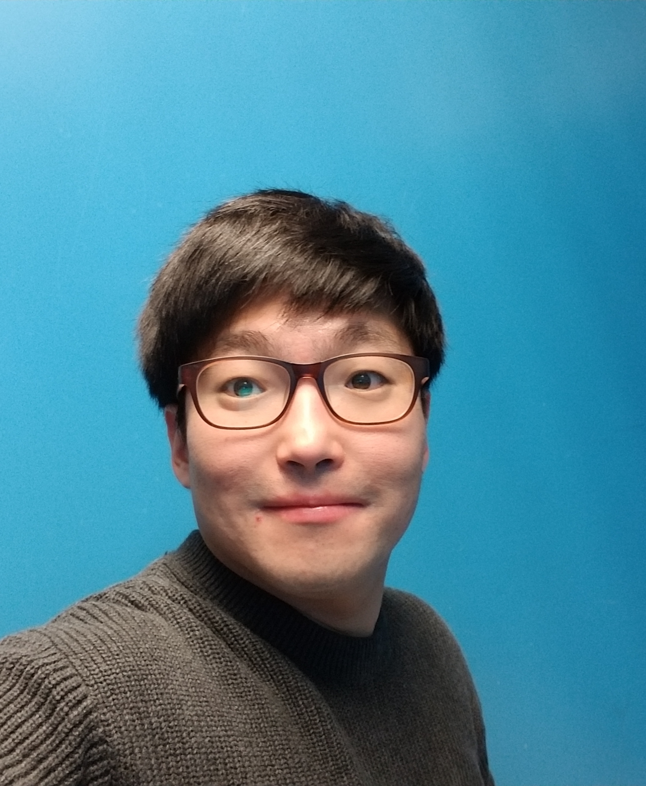

# **Ho Namkung**

Johns Hopkins University School of Medicine\
Meyer 4-148, 600 North Wolfe Street\
Baltimore, MD 21287\
Email: hnamkun1@jhmi.edu or namkungho87@gmail.com

I am a Neuroscience PhD student in Bernardo Sabatini's Lab at the Harvard Medical School, where I study mechanism and function of neurotransmitter co-release using electrophysiology, optogenetics, and model simulation.

I joined the Harvard PiN program in 2016 and worked on rotation projects with Jan Drugowitsch and Wei-Chung Lee. Prior to starting PhD, I was a research assistant in Larry Synder's lab at Washington University School of Medicine. I obtained a Bachelor's degree in Biomedical Engineering from Washington University in St. Louis in 2015. As an undergrad, I worked in ShiNung Ching's lab.
